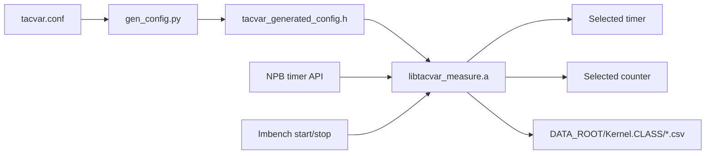

# TacVar

TacVar is a toolset for tackling variability in parallel running time measurement. It includes several tools to measure, quantify and filter unstable timing readings in multi-core processors and accelerators.

Here are core tools in TacVar:
- ParTES: Measuring the minimal 'measurable' running time of your server under different run-time environment.
- Vkern: Obeserving the deviation and error of your performance measurement results caused by timing fluctuation.
- Filter: Filtering a noisy running time distribution for better measurement accuracy.

Related publications:

Q. Liao and J. Lin, "TacVar: Tackling Variability in Short-Interval Timing Measurements on X86 Processors," 2024 IEEE 24th International Symposium on Cluster, Cloud and Internet Computing (CCGrid), Philadelphia, PA, USA, 2024, pp. 496-506, doi: 10.1109/CCGrid59990.2024.00062. (Best paper award)

Q. Liao, S. Zuo, Y. Wang and J. Lin. Timing Method and Evaluation Metrics for CPU Performance Variation Detections [J]. Chinese Journal of Computers，2024，47：456-472, doi: 10.11897/SP.J.1016.2024.00456. ([Download Paper](http://cjc.ict.ac.cn/online/onlinepaper/lqc-2024229165011.pdf))

LIAO Qiucheng, ZHOU Yang, LIN Xinhua. Metrics and Tools for Evaluating the Deviation in Parallel Timing[J]. Computer Science, 2025, 52(5): 41-49. doi: 10.11896/jsjkx.241200053 ([Download Paper](https://www.jsjkx.com/CN/article/openArticlePDF.jsp?id=23149))


## 1 Introduction

VKern generates run time variations which can be configured by given statistical distributions. By using different timing methods to measure the run time of the specific distribution, one can investigate the instability caused by timing fluctuations in parallel short-interval timing. Furthermore, based on the timing fluctuation distribution sample, FilT can help estimate the real distribution of timing results by decoupling the timing fluctuation from measurement results.

This repository is a preliminary code base for validating the methodology. For broaden the usage of the method, it will soon be integrated into our open-source instrumentation-based profiling tool PerfHound.

## 2 A simple use case

### 2.1 Preparing the test environment

### 2.2 Compiling source codes

### 2.3 Running VKern and visulizing timing fluctuations

### 2.4 Sampling timing fluctuations

### 2.5 Filtering the timing fluctuation with FilT

``` bash

$ ./filt.x --help
Usage: filt.x [OPTION...]

  -g, --hz-ns=FREQ           Tick per ns of the clock
  -l, --plow=PROB            Lowest threshold of possibility of a data bin
  -m, --met-file=FILE        Input measurement file
  -n, --nsamp=NSAMP          Number of samples in each optimization step
  -s, --sample-file=FILE     Input timing fluctuation file
  -w, --width=TIME           The least interval of a time bin (ns).
  -x, --cut-x=PROB           Cut the highest probability of met array
  -y, --cut-y=PROB           Cut the highest probability of timing fluctuation
                             array
  -?, --help                 Give this help list
      --usage                Give a short usage message

```

## 3 NPB / lmbench multi-timer and counter interface

Shared measurement support for **NPB-MPI**, **NPB-OMP**, and **lmbench** lives under `src/measure/`. Backends are selected at **build time** via each suite's `tacvar.conf`. Hot-path timer/counter reads use generated macros / `static inline` code (no runtime backend vtable). NPB `timer_start`/`timer_stop` take `(region_id, loc_id)`; measurement CSV paths are `DATA_ROOT/Kernel.CLASS/<short_host>_r*_t*_p*.csv`.



### 3.1 Architecture and support matrix

| Timer (`TACVAR_TIMER`) | x86_64 | aarch64 | NPB-MPI | NPB-OMP | lmbench |
|------------------------|:------:|:-------:|:-------:|:-------:|:-------:|
| `native` | yes | yes | → `mpi_wtime` | → `omp_get_wtime` | → `gettimeofday` |
| `gettimeofday` | yes | yes | no | no | yes |
| `omp_get_wtime` | yes | yes | no | yes | no |
| `mpi_wtime` | yes | yes | yes | no | no |
| `clock_gettime` | yes | yes | yes | yes | yes |
| `papi_get_real_nsec` | yes* | yes* | yes | yes | yes |
| `rdtsc` / `rdtscp` / `rdtscp_lfence` / `tsc_asym` | yes | no | yes | yes | yes |
| `cntvct_el0` / `cntvct_el0_dmb` | no | yes† | yes | yes | yes |

| Counter (`TACVAR_COUNTER_BACKEND`) | Notes |
|------------------------------------|--------|
| `none` | Default; no hardware counters |
| `perf_event_open` | Userspace events (`exclude_kernel=1`); needs usable `perf_event_paranoid` |
| `papi_read` | Needs PAPI; set `PAPI_HOME` |
| `asm` | x86 `RDPMC` or ARM `MRS` via `ph_enable_pmu` kmod |

\* Requires PAPI. † Requires non-zero `TACVAR_NSTP` (ns per CNTVCT tick). Arch is detected from the **compiler** (`-dM -E`), not from `uname` alone.

### 3.2 Public API (non-hot path)

Header: `src/measure/include/tacvar_measure.h`.

- `tacvar_init(const tacvar_context_t *ctx)` / `tacvar_fini()` — directory, CSV, selected backends; safe after `fork` (PID reset).
- `tacvar_csv_write_simple(...)` — one CSV row per start/stop interval (called outside the timed region).
- Hot path (from generated config): `TACVAR_TIMER_BEGIN/END/DELTA_NS`, `TACVAR_COUNTER_READ`, `TACVAR_COUNTER_DELTAS`.

Naming: exported C symbols `tacvar_*`; macros/enums `TACVAR_*`; NPB/lmbench adapters `tacvar_npb_*` / `tacvar_lmbench_*`.

### 3.3 Configuration (`tacvar.conf`)

Suite paths:

- `suites/NPB3.4.4/NPB3.4-MPI/tacvar.conf`
- `suites/NPB3.4.4/NPB3.4-OMP/tacvar.conf`
- `suites/lmbench/tacvar.conf`

Fields:

```text
TACVAR_TIMER=native              # see matrix above
TACVAR_NSTP=0                    # ns/tick for CNTVCT; e.g. 10 for 100 MHz
TACVAR_COUNTER_BACKEND=none
TACVAR_COUNTER_COUNT=0           # must match number of names
TACVAR_COUNTER_NAMES=            # comma-separated, e.g. cpu-cycles,instructions
TACVAR_OUTPUT_ROOT=.             # CSV root relative to benchmark cwd
```

Change conf → **rebuild** the suite. Runtime does not switch backends. Invalid consumer/arch combinations are rejected by `src/measure/tools/gen_config.py`.

### 3.4 Build

**Dependencies:** OpenMPI (NPB-MPI), optional PAPI (`papi_get_real_nsec` / `papi_read`), and for `asm` counters the `ph_enable_pmu` kmod (see `src/kmod/`). For `perf_event_open` as non-root with `perf_event_paranoid >= 2`, TacVar opens events with `exclude_kernel=1`.

Put MPI/PAPI on `PATH` / `LD_LIBRARY_PATH` (and set `PAPI_HOME` when needed) before building.

**NPB-MPI / NPB-OMP** 

`make veryclean` removes `config/make.def`; the next build copies it from `make.def.template`

```bash
# Edit the suite tacvar.conf, then:
cd suites/NPB3.4.4/NPB3.4-OMP && make CG CLASS=S
cd suites/NPB3.4.4/NPB3.4-MPI && make IS CLASS=S
```

**lmbench** (from `suites/lmbench/src`):

```bash
# export PAPI_HOME=...   # if using PAPI backends
../scripts/build ../bin/$(../scripts/os)/lat_syscall
# or build lmbench.a / timing_o / enough with the same relative $O paths
```

Standalone measure library:

```bash
make -C src/measure CONF=suites/lmbench/tacvar.conf CONSUMER=lmbench \
  OUTDIR=/tmp/tacvar_build CC=gcc \
  PAPI_INC=$PAPI_HOME/include PAPI_LIB=$PAPI_HOME/lib
```

### 3.5 CSV output

Each run creates **one** `data_YYYYMMDDTHHmmss/` (`DATA_ROOT`) under the benchmark cwd (`TACVAR_OUTPUT_ROOT`). Override with `TACVAR_DATA_DIR` to reuse an existing directory (e.g. after fork/exec). Files are nested by kernel:

```text
<DATA_ROOT>/<Kernel>.<CLASS>/timer_info.csv
<DATA_ROOT>/<Kernel>.<CLASS>/<short_host>_rRRRR_tTTTT_pPID.csv
```

Example: `data_20260813T082100/is.S/c920bn1_r0000_t0000_p12345.csv`. `short_host` is `hostname -s` (never FQDN). Opened in append mode; header is written once on the first row. `timer_info.csv` lists `region_id,nloc,name` once per run.

**Base header** (always present; comma-separated, no quoting):

```text
seq,suite,benchmark,class,test_tag,region_id,loc_id,timer,
raw_start,raw_stop,elapsed_ns,rank,thread,pid,cpu_start,cpu_stop,
migrated,valid
```

| Column | Type | Meaning |
|--------|------|---------|
| `seq` | uint | Per-file row counter (1-based) |
| `suite` | string | `npb-mpi`, `npb-omp`, or `lmbench` |
| `benchmark` | string | e.g. `is`, `cg`, `lat_syscall` |
| `class` | string | NPB class letter (`S`…`E`); often `X` / empty for lmbench |
| `test_tag` | string | Optional sub-test label (may be empty) |
| `region_id` | int | Timed region index (NPB timer slot, or 0 for lmbench) |
| `loc_id` | int | Call-site id within the same `region_id` (NPB); 0 for lmbench |
| `timer` | string | Build-time timer name (`TACVAR_TIMER`) |
| `raw_start` / `raw_stop` | uint64 | Backend-native tick / timestamp at begin/end |
| `elapsed_ns` | int64 | Duration in nanoseconds (`TACVAR_TIMER_DELTA_NS`); always ≥ 0 |
| `rank` | int | MPI rank, else 0 |
| `thread` | int | OpenMP thread id (updated at write), else 0 |
| `pid` | int | Writer process id |
| `cpu_start` / `cpu_stop` | int | `sched_getcpu()` at begin/end; −1 if unavailable |
| `migrated` | 0/1 | 1 if both CPUs known and `cpu_start != cpu_stop` |
| `valid` | 0/1 | 0 when migrated (asm counters unsafe across cores); else 1 |

**Counter columns** (only when `TACVAR_COUNTER_COUNT > 0`):

```text
...,valid,counter_backend,<name>_start,<name>_stop,<name>_delta[,...]
```

- `counter_backend` — build-time backend (`perf_event_open`, `papi_read`, `asm`).
- For each name in `TACVAR_COUNTER_NAMES`, three columns: raw start, raw stop, and modular wrap-safe delta (`*_delta`).

Example with `cpu-cycles,instructions`:

```text
seq,suite,benchmark,class,test_tag,region_id,loc_id,timer,raw_start,raw_stop,elapsed_ns,rank,thread,pid,cpu_start,cpu_stop,migrated,valid,counter_backend,cpu-cycles_start,cpu-cycles_stop,cpu-cycles_delta,instructions_start,instructions_stop,instructions_delta
1,npb-omp,cg,S,,0,1,clock_gettime,123...,456...,789,0,0,12345,3,3,0,1,perf_event_open,1000,2500,1500,8000,12000,4000
```

Notes:

- One row per start/stop interval; written outside the timed region (buffered, ~64 KiB).
- Prefer binding (`mpirun --bind-to core`, `OMP_PROC_BIND`, `taskset`) so `migrated` stays 0 for asm counters.
- With `TACVAR_COUNTER_BACKEND=none`, the file stops at `valid` (no `counter_backend` column).
- NPB `timer_read(n)` still sums all `loc_id` sites for slot `n`; `loc_id` is a CSV annotation only.
### 3.6 Subject-code boundary

**Unchanged:** NPB benchmark kernels (BT/CG/…), lmbench `lat_*` / `bw_*` kernels and `bench.h` body logic.

**Allowed adapters only:** NPB `common/c_timers.c`, `common/timers.f90`, `common/tacvar_npb.*`; lmbench `lib_timing.c` boundaries, `tacvar_lmbench.*`; suite Makefiles / `scripts/build`; `src/measure/**`.

Protected-path list for tests: `src/measure/tests/protected_sources.txt`.

### 3.7 Test scripts

```bash
# Unit / mock (config validation, TSC join, wrap delta, CSV schema)
bash src/measure/tests/run_unit_tests.sh

# Build every legal timer/counter for this arch (temp conf; does not edit suite confs)
bash src/measure/tests/run_backend_smoke.sh

# NPB: --build-only | --run-smoke  (CG Class S OMP<=4, IS Class S MPI np=4)
bash suites/NPB3.4.4/test_tacvar.sh --run-smoke

# lmbench: lat_syscall null on one core; optional platform combo
bash suites/lmbench/scripts/test_tacvar.sh --run-smoke

# ARM host smoke (needs MPI/PAPI/kmod on that machine)
bash src/measure/tests/run_arm_tests.sh
```

x86 smoke matrix (scripted): `native+none` for all three suites; then lmbench `tsc_asym+asm`, NPB-OMP `clock_gettime+perf_event_open`, NPB-MPI `mpi_wtime+papi_read`. ARM: `native+none`, then lmbench `cntvct_el0+perf_event_open`, NPB-OMP `cntvct_el0_dmb+asm`, NPB-MPI `mpi_wtime+perf_event_open` (set `TACVAR_NSTP` / `TACVAR_NSTP_ARM` to ns per CNTVCT tick from `CNTFRQ_EL0`). If PAPI’s HW component is unavailable on a platform, use `perf_event_open` or `asm` instead of `papi_read`; `papi_get_real_nsec` may still build.

Acceptance: exit 0; NPB `Verification = SUCCESSFUL`; lmbench prints a syscall latency; CSV present with matching timer/counter names; protected sources unchanged.

### 3.8 Manual run examples

```bash
# NPB-OMP
cd suites/NPB3.4.4/NPB3.4-OMP
OMP_NUM_THREADS=4 OMP_PROC_BIND=true ./bin/cg.S.x
ls -d data_*

# NPB-MPI
cd suites/NPB3.4.4/NPB3.4-MPI
mpirun -np 4 --bind-to core ./bin/is.S.x

# lmbench
cd suites/lmbench
taskset -c 0 ./bin/$(cd src && ../scripts/os)/lat_syscall null
```

### 3.9 Troubleshooting

| Symptom | Likely cause |
|---------|----------------|
| `perf_event_open ... Permission denied` | Need `exclude_kernel` (already set) or lower `perf_event_paranoid`; or use `papi_read` / `asm` |
| `cannot open ph_enable_pmu` | Load kmod before `asm` |
| `cntvct` rejected / bad ns | Set `TACVAR_NSTP` (ns/tick); check `CNTFRQ_EL0` |
| Stale counter symbols after conf change | Remove `config/tacvar_build_$(uname -m)` (NPB) or `bin/$OS/tacvar_build` + `lib_timing.o` (lmbench) and rebuild |
| lmbench `lat_rpc` fails | Missing `libtirpc-devel`; non-RPC tools still build via `src/compat` stubs |
| Wrong `bin/` OS dir for lmbench | Run `scripts/os` from `src/` so `gnu-os` is found |
| `PAPI_add_event ... Component ... disabled` | PAPI HW component unavailable on this CPU; use `perf_event_open` or `asm` |
| `setparams: cannot execute binary file` | NFS-shared x86/ARM objects; remove `sys/setparams` / `common/*.o` and rebuild on the current host |
